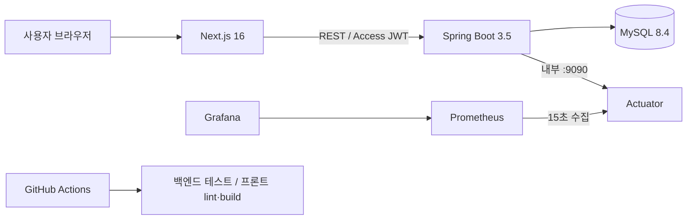
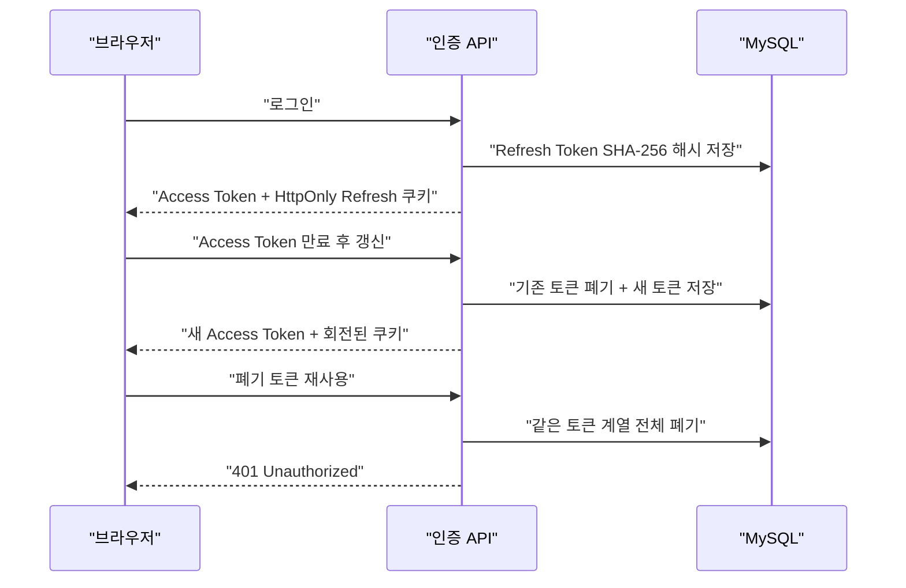
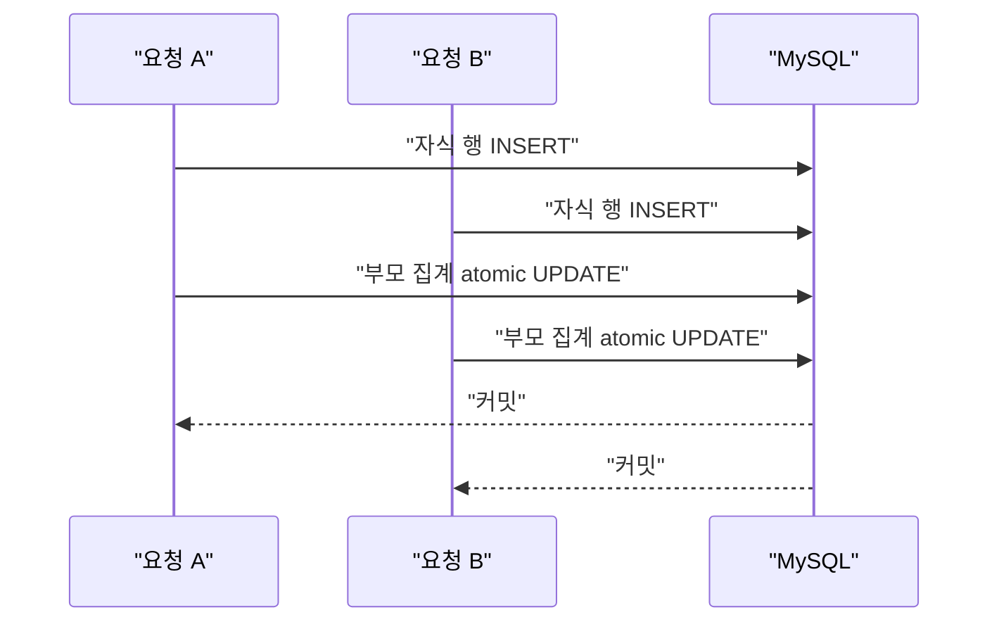
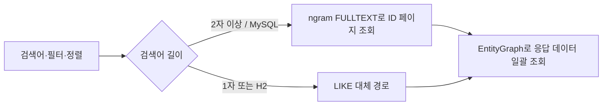

# Re:Fail 시스템 아키텍처와 핵심 흐름

## 1. 전체 구조

현재 제품은 텍스트 중심 MVP이므로 Spring Boot 단일 서버를 선택했다. 배포 단위는 하나지만 `auth`, `post`, `reaction`, `report`, `admin` 도메인 패키지로 경계를 나누어 이후 분리 가능성을 유지한다.

## 2. JWT 수명주기

- Access Token 기본 수명은 15분이다.
- Refresh Token 원문은 서버에 저장하지 않는다.
- 동시에 여러 API가 401을 받아도 프론트엔드는 갱신 요청을 하나만 실행한다.
- 로그아웃과 사용자 제한 시 활성 Refresh Token을 모두 폐기한다.

## 3. 공감·신고 동시성

애플리케이션에서 값을 읽고 더한 뒤 저장하면 lost update가 발생할 수 있다. 공감·신고는 DB 원자적 UPDATE로 집계를 변경하고, 자식 INSERT 후 부모 UPDATE 순서로 잠금 순서를 통일한다. MySQL Testcontainers에서 각 8개 동시 요청 후 실제 행 수와 집계 값이 일치하는지 검증한다.

## 4. 검색 조회

FULLTEXT는 제목, 본문, 감정 태그를 대상으로 한다. 카테고리·실패 크기·공개 상태 필터와 페이지네이션을 함께 적용하며, 1자 검색은 ngram 특성상 LIKE 대체 경로를 사용한다.

## 5. 관측성과 보안 경계

- 공개 API 포트는 `8080`, 내부 관리 포트는 `9090`이다.
- Compose는 관리 포트를 호스트에 공개하지 않는다.
- Prometheus만 Docker 내부 네트워크에서 메트릭을 수집한다.
- 일반 실행에서는 `/actuator/prometheus`에 관리자 JWT가 필요하다.
- 메트릭 라벨에는 사용자 ID, IP, 이메일, 검색어를 넣지 않는다.
