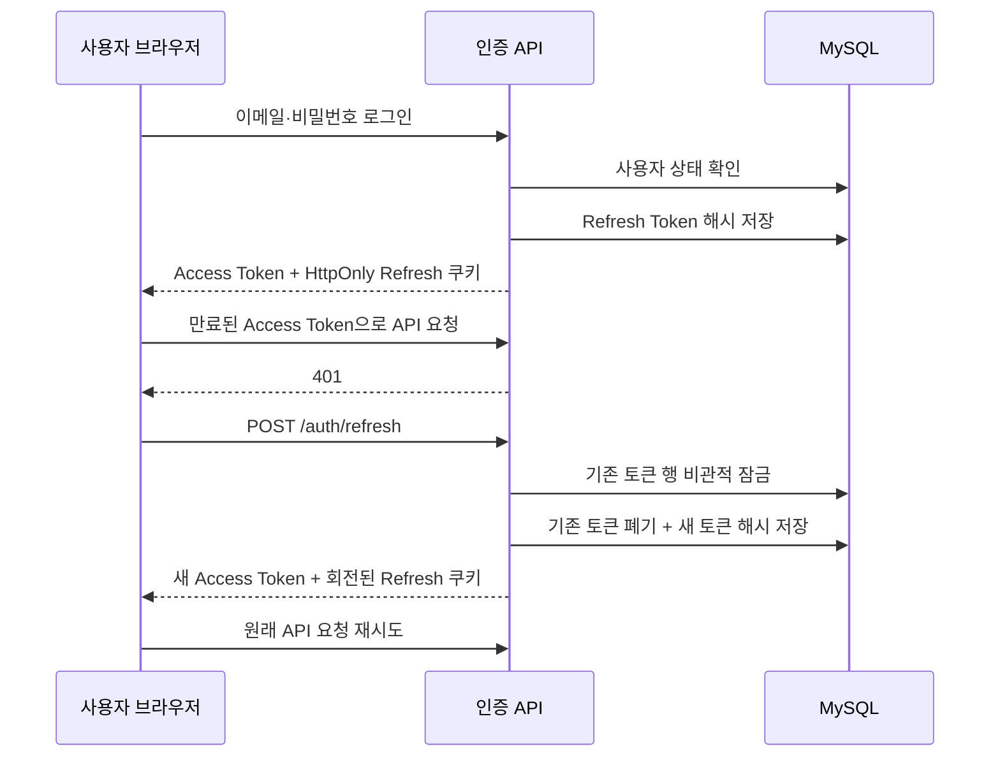

# Re:Fail 인증 수명주기와 보안 정책

## 1. 목적

Re:Fail은 짧은 수명의 JWT Access Token과 회전형 Refresh Token을 함께 사용한다. Access Token 탈취 영향을 줄이면서 사용자가 로그인 상태를 안전하게 이어가도록 하는 것이 목적이다.

## 2. 토큰 정책

| 구분 | 저장 위치 | 기본 유효시간 | 서버 저장 |
| --- | --- | ---: | --- |
| Access Token | 브라우저 `localStorage` | 15분 | 저장하지 않음 |
| Refresh Token | `HttpOnly` 쿠키 | 30일 | SHA-256 해시만 저장 |

- Access Token은 `Authorization: Bearer` 헤더에 사용한다.
- Refresh Token은 256비트 난수이며 JavaScript에서 읽을 수 없는 쿠키로 전달한다.
- 운영 환경에서는 Refresh 쿠키에 `Secure`를 적용한다.
- 쿠키는 `SameSite=Lax`, `Path=/api/v1/auth`로 제한한다.
- Refresh Token 원문, JWT, 비밀번호는 로그에 남기지 않는다.

## 3. 발급과 회전 흐름

프론트엔드는 여러 요청이 동시에 `401`을 받아도 하나의 Refresh 요청만 보내는 single-flight 방식을 사용한다.

## 4. 재사용 탐지

- 정상 회전 직후 짧은 유예 구간에 같은 토큰이 다시 오면 중복 갱신으로 판단하고 `AUTH_005`를 반환한다.
- 유예 구간이 지난 폐기 토큰이 재사용되면 탈취 가능성으로 판단한다.
- 재사용이 탐지되면 같은 `familyId`의 활성 Refresh Token을 모두 폐기한다.
- 사용자 제한 시 해당 사용자의 모든 활성 Refresh Token을 즉시 폐기한다.

유예 구간은 네트워크 중복 요청이 정상 세션까지 모두 폐기하는 것을 방지하기 위한 절충이다. 프론트엔드 single-flight와 서버의 비관적 잠금을 함께 사용해 유효한 토큰 흐름은 하나만 유지한다.

## 5. 로그아웃

`POST /api/v1/auth/logout`은 현재 Refresh Token을 폐기하고 브라우저 쿠키의 수명을 `0`으로 설정한다. Access Token은 서버에 저장하지 않으므로 남은 유효시간 동안 형식상 유효할 수 있지만, 보호 API의 현재 사용자 상태 검증과 15분의 짧은 만료시간으로 위험을 제한한다.

즉시 Access Token까지 폐기해야 하는 운영 요구가 생기면 토큰 버전 또는 짧은 TTL 차단 목록 도입을 검토한다.

## 6. 검증

- `AuthSessionIntegrationTest`: 로그인, 해시 저장, 회전, 중복 갱신, 로그아웃, 제한 사용자 정책
- `MySqlCoreIntegrationTest`: Flyway `V6`, MySQL 비관적 잠금, 동시 갱신 후 활성 토큰 1개
- `JwtTokenProviderTest`: 서명과 issuer 검증

## 7. 환경 변수

| 변수 | 기본값 | 설명 |
| --- | --- | --- |
| `JWT_ACCESS_TOKEN_VALIDITY_SECONDS` | `900` | Access Token 유효시간 |
| `JWT_REFRESH_TOKEN_VALIDITY_SECONDS` | `2592000` | Refresh Token 유효시간 |
| `JWT_REFRESH_REUSE_GRACE_SECONDS` | `5` | 정상 중복 요청 유예시간 |
| `JWT_REFRESH_COOKIE_SECURE` | `true` | HTTPS 전용 쿠키 여부 |

로컬 HTTP 실행에서는 `JWT_REFRESH_COOKIE_SECURE=false`, 실제 HTTPS 운영 환경에서는 반드시 `true`를 사용한다.

