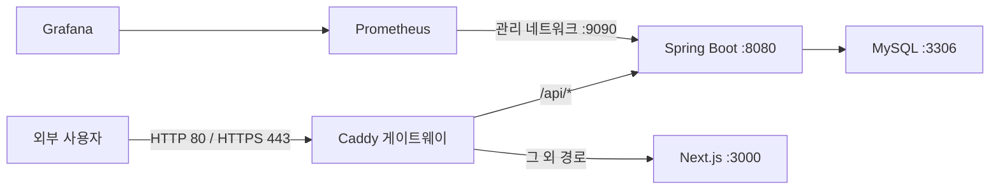

# Re:Fail 운영 배포 가이드

## 1. 문서 목적

이 문서는 Re:Fail을 단일 Docker 서버에 배포할 때의 공개 범위, 신뢰 경계, 보안 기본값과 자동 검증 계약을 정의한다.

현재 목표는 Kubernetes나 다중 서버가 아니라 무료·저비용 단일 서버에서 재현 가능한 운영 구조다. 단일 장애점과 서버 운영 책임은 숨기지 않고 별도 위험으로 관리한다.

## 2. 변경 전 기준선

개발용 `compose.yaml`은 로컬 디버깅을 위해 다음 포트를 호스트에 공개한다.

| 서비스 | 기본 호스트 포트 | 용도 |
| --- | ---: | --- |
| MySQL | `13306` | 로컬 DB 확인 |
| Spring Boot API | `18080` | API·Swagger 개발 |
| Next.js | `3000` | 웹 개발 |
| Prometheus | `127.0.0.1:19090` | 로컬 메트릭 |
| Grafana | `127.0.0.1:13000` | 로컬 대시보드 |

이 구성은 개발 편의를 위한 것이며 운영 경계로 사용하지 않는다.

## 3. 목표 토폴로지

운영 계약:

| 경계 | 정책 |
| --- | --- |
| 외부 공개 | Caddy의 HTTP·HTTPS 포트만 공개 |
| HTTP | HTTPS로 리다이렉트 |
| 브라우저 API | 동일 출처 `/api/*` 사용 |
| Next.js SSR | Docker 내부 `http://backend:8080` 사용 |
| MySQL | Docker 데이터 네트워크에서만 접근 |
| Spring Boot API·management | Docker 내부에서만 접근 |
| Next.js | Caddy를 통해서만 접근 |
| Prometheus·Grafana | 호스트 포트 미공개, 필요 시 SSH 터널 사용 |
| Swagger | 운영 기본 비활성화 |

## 4. 신뢰 경계와 위협 모델

### 보호 자산

- 사용자 이메일, 비밀번호 해시와 계정 상태
- 익명 게시글의 실제 작성자 연결 정보
- Access Token과 Refresh Token
- 신고 사유와 관리자 처리 이력
- MySQL 데이터와 백업 파일
- JWT, DB, Grafana 시크릿

### 주요 위협과 대응

| 위협 | 대응 |
| --- | --- |
| DB·백엔드 직접 스캔 | 운영 Compose에서 호스트 포트 제거 |
| 평문 세션 탈취 | HTTPS 강제, Refresh Cookie `Secure`·`HttpOnly` |
| 전달 IP 위조로 요청 제한 우회 | 외부 입력 헤더를 Caddy가 덮어쓰고 내부 백엔드만 전달 헤더 신뢰 |
| 브라우저 CORS·쿠키 불일치 | 웹과 API를 동일 출처로 제공 |
| 클릭재킹·MIME 스니핑 | 게이트웨이 보안 응답 헤더 |
| 운영 API 문서 노출 | `SWAGGER_ENABLED=false` |
| 관리 메트릭 외부 노출 | management·Prometheus·Grafana 호스트 포트 제거 |
| 시크릿 저장소 유출 | 실제 값은 서버의 `.env.production`에만 저장 |
| 컨테이너 권한 상승 | 비루트 이미지, `no-new-privileges`, 불필요 capability 제거 |

### 전달 IP 신뢰 조건

백엔드의 `RATE_LIMIT_TRUST_FORWARDED_FOR=true`는 다음 두 조건이 모두 충족될 때만 허용한다.

1. 백엔드 `8080` 포트는 호스트에 공개되지 않고 Caddy와 같은 내부 네트워크에서만 접근한다.
2. Caddy는 클라이언트가 보낸 `X-Forwarded-For`, `X-Forwarded-Proto`, `X-Forwarded-Host`를 그대로 신뢰하지 않고 연결 정보로 다시 설정한다.

조건을 만족하지 못하는 구성에서는 전달 IP 신뢰를 끈다.

## 5. 자동 검증 계약

운영 배포 스모크 테스트는 다음을 확인해야 한다.

1. HTTP 요청이 HTTPS로 리다이렉트된다.
2. HTTPS 메인 화면과 `/api/v1/health`가 `200`이다.
3. 운영 Swagger 경로는 `404`다.
4. 로그인 응답 쿠키에 `Secure`, `HttpOnly`, `SameSite=Lax`, 제한된 `Path`가 있다.
5. Refresh Cookie로 Access Token을 갱신할 수 있다.
6. 인증 사용자가 게시글을 만들고 공개 API에서 조회할 수 있다.
7. 로그아웃 후 기존 Refresh Token은 사용할 수 없다.
8. 응답에 Request ID와 정의한 보안 헤더가 있다.
9. MySQL, Spring Boot, Next.js에 호스트 공개 포트가 없다.
10. 토큰, 쿠키와 비밀번호는 테스트 출력과 CI artifact에 포함되지 않는다.

## 6. 현재 남은 위험

- 단일 서버 장애 시 전체 서비스가 중단된다.
- 서버와 Docker 볼륨 백업·복구는 운영자 책임이다.
- Caddy 자동 인증서 발급에는 실제 도메인의 DNS와 외부 80·443 포트 접근이 필요하다.
- 로컬 검증의 Caddy 내부 CA는 운영용 공개 인증서가 아니다.
- 장시간 부하, 디스크 고갈, 호스트 침해와 다중 서버 장애 조치는 이번 범위에 포함하지 않는다.

운영 Compose 구현, 실행·업데이트·백업·복구 명령은 다음 단계에서 이 문서에 추가한다.
