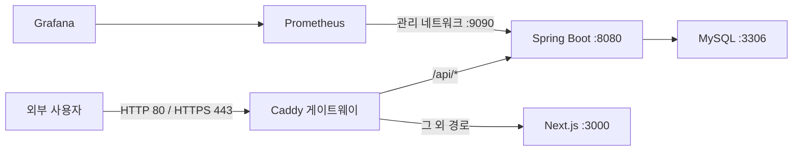

# Re:Fail 운영 배포 가이드

## 1. 문서 목적

이 문서는 Re:Fail을 단일 Docker 서버에 배포할 때의 공개 범위, 신뢰 경계, 보안 기본값과 자동 검증 계약을 정의한다.

현재 목표는 Kubernetes나 다중 서버가 아니라 무료·저비용 단일 서버에서 재현 가능한 운영 구조다. 단일 장애점과 서버 운영 책임은 숨기지 않고 별도 위험으로 관리한다.

## 2. 변경 전 기준선

개발용 `compose.yaml`은 로컬 디버깅을 위해 다음 포트를 호스트에 공개한다.

| 서비스 | 기본 호스트 포트 | 용도 |
| --- | ---: | --- |
| MySQL | `13306` | 로컬 DB 확인 |
| Spring Boot API | `18080` | API·Swagger 개발 |
| Next.js | `3000` | 웹 개발 |
| Prometheus | `127.0.0.1:19090` | 로컬 메트릭 |
| Grafana | `127.0.0.1:13000` | 로컬 대시보드 |

이 구성은 개발 편의를 위한 것이며 운영 경계로 사용하지 않는다.

## 3. 목표 토폴로지



운영 계약:

| 경계 | 정책 |
| --- | --- |
| 외부 공개 | Caddy의 HTTP·HTTPS 포트만 공개 |
| HTTP | HTTPS로 리다이렉트 |
| 브라우저 API | 동일 출처 `/api/*` 사용 |
| Next.js SSR | Docker 내부 `http://backend:8080` 사용 |
| MySQL | Docker 데이터 네트워크에서만 접근 |
| Spring Boot API·management | Docker 내부에서만 접근 |
| Next.js | Caddy를 통해서만 접근 |
| Prometheus·Grafana | 호스트 포트 미공개, 필요 시 SSH 터널 사용 |
| Swagger | 운영 기본 비활성화 |

## 4. 신뢰 경계와 위협 모델

### 보호 자산

- 사용자 이메일, 비밀번호 해시와 계정 상태
- 익명 게시글의 실제 작성자 연결 정보
- Access Token과 Refresh Token
- 신고 사유와 관리자 처리 이력
- MySQL 데이터와 백업 파일
- JWT, DB, Grafana 시크릿

### 주요 위협과 대응

| 위협 | 대응 |
| --- | --- |
| DB·백엔드 직접 스캔 | 운영 Compose에서 호스트 포트 제거 |
| 평문 세션 탈취 | HTTPS 강제, Refresh Cookie `Secure`·`HttpOnly` |
| 전달 IP 위조로 요청 제한 우회 | 외부 입력 헤더를 Caddy가 덮어쓰고 내부 백엔드만 전달 헤더 신뢰 |
| 브라우저 CORS·쿠키 불일치 | 웹과 API를 동일 출처로 제공 |
| 클릭재킹·MIME 스니핑 | 게이트웨이 보안 응답 헤더 |
| 운영 API 문서 노출 | `SWAGGER_ENABLED=false` |
| 관리 메트릭 외부 노출 | management·Prometheus·Grafana 호스트 포트 제거 |
| 시크릿 저장소 유출 | 실제 값은 서버의 `.env.production`에만 저장 |
| 컨테이너 권한 상승 | 비루트 이미지, `no-new-privileges`, 불필요 capability 제거 |

### 전달 IP 신뢰 조건

백엔드의 `RATE_LIMIT_TRUST_FORWARDED_FOR=true`는 다음 두 조건이 모두 충족될 때만 허용한다.

1. 백엔드 `8080` 포트는 호스트에 공개되지 않고 Caddy와 같은 내부 네트워크에서만 접근한다.
2. Caddy는 클라이언트가 보낸 `X-Forwarded-For`, `X-Forwarded-Proto`, `X-Forwarded-Host`를 그대로 신뢰하지 않고 연결 정보로 다시 설정한다.

조건을 만족하지 못하는 구성에서는 전달 IP 신뢰를 끈다.

## 5. 자동 검증 계약

운영 배포 스모크 테스트는 다음을 확인해야 한다.

1. HTTP 요청이 HTTPS로 리다이렉트된다.
2. HTTPS 메인 화면과 `/api/v1/health`가 `200`이다.
3. 운영 Swagger 경로는 `404`다.
4. 로그인 응답 쿠키에 `Secure`, `HttpOnly`, `SameSite=Lax`, 제한된 `Path`가 있다.
5. Refresh Cookie로 Access Token을 갱신할 수 있다.
6. 인증 사용자가 게시글을 만들고 공개 API에서 조회할 수 있다.
7. 로그아웃 후 기존 Refresh Token은 사용할 수 없다.
8. 응답에 Request ID와 정의한 보안 헤더가 있다.
9. MySQL, Spring Boot, Next.js에 호스트 공개 포트가 없다.
10. 토큰, 쿠키와 비밀번호는 테스트 출력과 CI artifact에 포함되지 않는다.

## 6. 현재 남은 위험

- 단일 서버 장애 시 전체 서비스가 중단된다.
- 서버와 Docker 볼륨 백업·복구는 운영자 책임이다.
- Caddy 자동 인증서 발급에는 실제 도메인의 DNS와 외부 80·443 포트 접근이 필요하다.
- 로컬 검증의 Caddy 내부 CA는 운영용 공개 인증서가 아니다.
- 장시간 부하, 디스크 고갈, 호스트 침해와 다중 서버 장애 조치는 이번 범위에 포함하지 않는다.

## 7. 서버 사전 요구사항

- Linux 단일 서버
- Docker Engine과 Docker Compose v2.24 이상
- 서버를 가리키는 도메인 A 또는 AAAA 레코드
- 외부에서 접근 가능한 TCP 80·443 포트
- 저장소를 내려받고 `.env.production`을 보관할 운영자 계정
- MySQL 데이터와 백업을 저장할 충분한 디스크

Docker Compose의 `!reset` 태그로 개발용 포트 매핑을 제거하므로 오래된 Compose 버전을 사용하지 않는다.

## 8. 최초 배포

1. 운영 환경 변수 예시를 복사한다.

```bash
cp .env.production.example .env.production
```

2. 다음 값을 실제 환경에 맞게 반드시 교체한다.

- `APP_DOMAIN`, `PUBLIC_ORIGIN`
- `MYSQL_PASSWORD`, `MYSQL_ROOT_PASSWORD`
- `JWT_SECRET`
- `GRAFANA_ADMIN_PASSWORD`

난수 시크릿은 서버에서 생성한다.

```bash
openssl rand -base64 48
```

3. 운영 스택을 실행한다.

```bash
docker compose \
  -f compose.yaml \
  -f compose.production.yaml \
  --env-file .env.production \
  up -d --build --wait --wait-timeout 240
```

4. 상태와 공개 주소를 확인한다.

```bash
docker compose \
  -f compose.yaml \
  -f compose.production.yaml \
  --env-file .env.production \
  ps

curl -I "http://${APP_DOMAIN}/api/v1/health"
curl -i "https://${APP_DOMAIN}/api/v1/health"
```

`ps` 결과에서 호스트 포트는 Caddy의 80·443만 보여야 한다. 백엔드 `8080·9090`, 프론트엔드 `3000`, MySQL `3306`은 컨테이너 내부 포트로만 표시돼야 한다.

## 9. 업데이트와 상태 확인

배포 전 DB 백업을 만든 뒤 fast-forward 가능한 변경만 가져온다.

```bash
git pull --ff-only origin main
docker compose \
  -f compose.yaml \
  -f compose.production.yaml \
  --env-file .env.production \
  up -d --build --wait --wait-timeout 240
```

서비스별 로그:

```bash
docker compose \
  -f compose.yaml \
  -f compose.production.yaml \
  --env-file .env.production \
  logs --tail 200 backend frontend caddy
```

내부 관리 상태:

```bash
docker compose \
  -f compose.yaml \
  -f compose.production.yaml \
  --env-file .env.production \
  exec backend wget -qO- http://127.0.0.1:9090/actuator/health
```

Prometheus·Grafana를 운영 서버에서 사용할 때도 외부 포트는 열지 않는다. 원격 UI가 필요하면 별도의 운영자 인증과 사설 네트워크 또는 loopback 전용 override를 설계한 뒤 사용한다.

## 10. MySQL 백업과 복구

백업 디렉터리는 저장소 밖 또는 접근 권한이 제한된 위치를 사용하고 다른 서버나 객체 저장소로 복제한다.

백업:

```bash
mkdir -p backups
docker compose \
  -f compose.yaml \
  -f compose.production.yaml \
  --env-file .env.production \
  exec -T mysql sh -c \
  'exec mysqldump --single-transaction -u"$MYSQL_USER" -p"$MYSQL_PASSWORD" "$MYSQL_DATABASE"' \
  > "backups/refail-$(date +%Y%m%d-%H%M%S).sql"
```

복구 전에는 현재 서비스를 중지하고 대상 DB와 백업 파일을 다시 확인한다. 복구는 기존 데이터를 변경하는 운영 작업이므로 자동 스모크에 포함하지 않는다.

```bash
docker compose \
  -f compose.yaml \
  -f compose.production.yaml \
  --env-file .env.production \
  stop backend frontend caddy

docker compose \
  -f compose.yaml \
  -f compose.production.yaml \
  --env-file .env.production \
  exec -T mysql sh -c \
  'exec mysql -u"$MYSQL_USER" -p"$MYSQL_PASSWORD" "$MYSQL_DATABASE"' \
  < backups/refail-YYYYMMDD-HHMMSS.sql
```

복구 후 애플리케이션을 다시 실행하고 헬스 체크와 대표 사용자 흐름을 확인한다.

## 11. 롤백

1. 장애 시점의 컨테이너 로그와 배포 커밋을 기록한다.
2. Flyway가 새 마이그레이션을 적용하지 않았다면 이전 Git 태그 또는 커밋으로 전환하고 이미지를 다시 빌드한다.
3. 새 마이그레이션이 적용됐다면 애플리케이션 코드만 되돌려도 호환되는지 먼저 확인한다.
4. 하위 호환되지 않는 스키마라면 배포 전 백업으로 DB를 복구한다.
5. `/api/v1/health`, 로그인·갱신, 게시글 조회를 다시 검증한다.

Flyway는 기본적으로 이미 적용된 마이그레이션을 자동 역실행하지 않는다. 따라서 배포 전 백업과 전방 호환 스키마 변경이 롤백의 전제다.

## 12. 자동 스모크

로컬과 CI에서는 Caddy 내부 CA와 별도 Docker 프로젝트를 사용한다. 시스템 신뢰 저장소는 변경하지 않는다.

```powershell
powershell.exe -NoProfile -ExecutionPolicy Bypass `
  -File .\scripts\test-production-deployment.ps1
```

스크립트는 다음을 자동 수행한다.

- 운영 Compose 렌더링과 이미지 빌드
- 네 서비스의 `healthy` 상태 확인
- Caddy 외 호스트 포트 비노출 확인
- HTTPS 핵심 흐름 10단계 검증
- 테스트 컨테이너·네트워크·볼륨 정리

실제 외부 도메인 배포는 클라우드·DNS 자격 증명이 필요하므로 저장소 자동화 범위에 포함하지 않는다.
