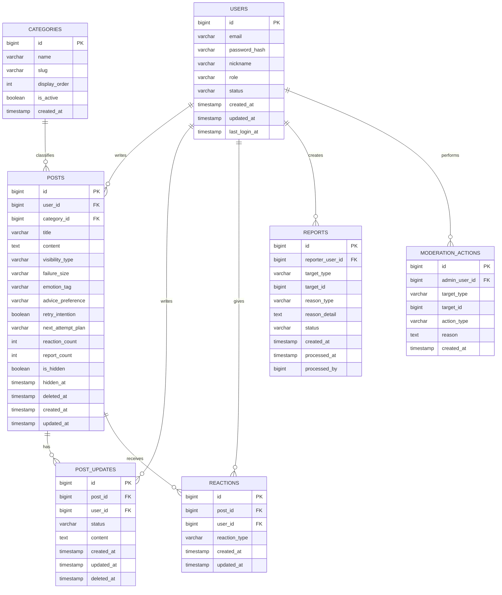

# ERD 문서

## 1. 문서 목적

이 문서는 `Fail` 프로젝트의 MVP 기준 데이터 구조를 정의한다.

기준 문서
- [PLAN.md](D:/Codex_Project/Fail/PLAN.md)
- [MVP_SPEC.md](D:/Codex_Project/Fail/MVP_SPEC.md)
- [HARNESS.md](D:/Codex_Project/Fail/HARNESS.md)

현재 ERD는 다음 기준을 따른다.
- 백엔드는 Spring Boot
- 데이터베이스는 MySQL 8 가정
- 댓글 기능은 MVP에서 제외
- 성공은 독립 게시글이 아니라 업데이트 상태값으로 표현

## 2. 설계 원칙

### 핵심 원칙
- 구조는 단순해야 한다
- 실패 글이 중심 엔티티여야 한다
- 업데이트를 통해 실패 이후 흐름이 보여야 한다
- 익명 공개와 닉네임 공개를 모두 지원해야 한다
- 신고와 운영 이력을 남길 수 있어야 한다

### MVP 기준 제약
- 댓글 테이블 없음
- 이미지 첨부 테이블 없음
- 팔로우/알림/북마크 없음
- 복잡한 권한 체계 없음

## 3. 엔티티 목록

### 필수 엔티티
- users
- categories
- posts
- post_updates
- reactions
- reports
- moderation_actions

### 선택 엔티티
- banned_words

## 4. 엔티티 상세

### 4-1. users
사용자 계정 정보와 기본 닉네임을 관리한다.

주요 컬럼
- id
- email
- password_hash
- nickname
- role
- status
- created_at
- updated_at
- last_login_at

설명
- 닉네임은 계정당 하나를 기준으로 한다
- role은 `USER`, `ADMIN`
- status는 `ACTIVE`, `RESTRICTED`, `DELETED` 정도로 시작한다

### 4-2. categories
실패 글 분류용 카테고리

주요 컬럼
- id
- name
- slug
- display_order
- is_active
- created_at

설명
- 카테고리는 관리자 기준으로 관리한다
- 예: 공부, 취업, 다이어트, 돈, 인간관계

### 4-3. posts
실패 글 원본 엔티티

주요 컬럼
- id
- user_id
- category_id
- title
- content
- visibility_type
- failure_size
- emotion_tag
- advice_preference
- retry_intention
- next_attempt_plan: 다음 시도에서 선택할 방법, 선택 입력
- reaction_count
- report_count
- is_hidden
- hidden_at
- deleted_at
- created_at
- updated_at

설명
- visibility_type은 `ANONYMOUS`, `NICKNAME`
- failure_size는 `SMALL`, `MEDIUM`, `LARGE`
- emotion_tag는 초기에 enum 또는 문자열로 관리 가능
- advice_preference는 `COMFORT`, `ADVICE_OK`
- 익명 글이어도 내부적으로는 user_id를 가진다
- 성공 게시글은 따로 없고 post는 항상 실패 글만 의미한다

### 4-4. post_updates
실패 글 이후의 변화와 후속 기록

주요 컬럼
- id
- post_id
- user_id
- status
- content
- created_at
- updated_at
- deleted_at

설명
- status는 `STILL_FAILING`, `TRYING_AGAIN`, `IMPROVING`, `SUCCEEDED`
- 원글 작성자만 업데이트 작성 가능
- 하나의 실패 글에 여러 업데이트가 달릴 수 있다
- 성공은 이 테이블의 `SUCCEEDED` 상태로 표현한다

### 4-5. reactions
게시글 공감 리액션

주요 컬럼
- id
- post_id
- user_id
- reaction_type
- created_at
- updated_at

설명
- 한 사용자는 한 게시글에 하나의 리액션만 가능하다
- unique 제약: `(post_id, user_id)`
- reaction_type 예시
  - ME_TOO
  - SEND_SUPPORT
  - THANKS_FOR_SHARING
  - CHEERING_NEXT_TRY

### 4-6. reports
신고 정보 저장

주요 컬럼
- id
- reporter_user_id
- target_type
- target_id
- reason_type
- reason_detail
- status
- created_at
- processed_at
- processed_by

설명
- 현재 MVP에서는 주 신고 대상이 게시글이다
- 확장성을 위해 target_type은 둔다
- target_type은 `POST`
- reason_type은 `ABUSE`, `HATE`, `SPAM`, `PRIVACY`, `OTHER`
- status는 `PENDING`, `RESOLVED`, `REJECTED`

### 4-7. moderation_actions
관리자의 운영 조치 이력 저장

주요 컬럼
- id
- admin_user_id
- target_type
- target_id
- action_type
- reason
- created_at

설명
- 운영 이력을 별도로 남겨 추적 가능하게 한다
- action_type 예시
  - HIDE_POST
  - UNHIDE_POST
  - RESTRICT_USER
  - ACTIVATE_USER

### 4-8. banned_words
금칙어 관리용 선택 테이블

주요 컬럼
- id
- word
- is_active
- created_at

설명
- MVP에서 꼭 필요하지는 않지만 운영 편의상 고려 가능

## 5. 엔티티 관계

### 기본 관계
- users 1 : N posts
- categories 1 : N posts
- posts 1 : N post_updates
- users 1 : N post_updates
- posts 1 : N reactions
- users 1 : N reactions
- users 1 : N reports
- users 1 : N moderation_actions

### 관계 해설
- 하나의 사용자는 여러 실패 글을 작성할 수 있다
- 하나의 실패 글은 하나의 카테고리에 속한다
- 하나의 실패 글에는 여러 개의 업데이트가 연결될 수 있다
- 하나의 사용자는 여러 글에 공감할 수 있지만, 같은 글에는 하나만 가능하다
- 신고와 운영 이력은 관리자 기능을 위해 분리한다

## 6. Mermaid ERD

## 7. 제약 조건 추천

### users
- email unique
- nickname unique 권장

### categories
- slug unique

### reactions
- unique `(post_id, user_id)`

### posts
- user_id not null
- category_id not null
- visibility_type not null
- title not null
- content not null

### post_updates
- post_id not null
- user_id not null
- status not null
- content not null

## 8. 삭제 정책

### 추천 방식
소프트 삭제 중심으로 간다.

### 이유
- 운영 이력 추적이 가능하다
- 신고 대응 시 근거가 남는다
- 포트폴리오에서도 운영 사고를 보여주기 좋다

### 적용 대상
- users
- posts
- post_updates

## 9. 조회 관점 메모

### 홈 피드 조회 시 필요한 정보
- 게시글 기본 정보
- 카테고리 정보
- 공개 작성 방식
- 리액션 수
- 최신 업데이트 존재 여부

### 게시글 상세 조회 시 필요한 정보
- 게시글 원문
- 작성 방식
- 카테고리
- 리액션 집계
- 업데이트 타임라인
- 신고 가능 여부

### 관리자 화면 조회 시 필요한 정보
- 신고 목록
- 신고 대상 게시글
- 신고 사유
- 현재 처리 상태
- 처리 관리자 정보

## 10. 구현 시 주의점

### 1. 익명 공개와 소유권은 분리
익명 글은 사용자에게 익명으로 보이지만, DB에서는 반드시 작성자 user_id를 가진다.

### 2. 성공은 post가 아니라 update 상태값
성공 게시글 테이블을 따로 만들지 않는다.

### 3. 리액션 카운트는 캐시성 컬럼으로 둔다
post.reaction_count를 두면 목록 조회가 편해진다.

### 4. 신고 대상은 확장 가능하게
현재는 게시글 중심이지만 target_type 구조를 두면 나중 확장이 쉽다.

## 11. 다음 작업 추천

1. API 명세서 작성
2. 엔티티 클래스 초안 작성
3. DB 마이그레이션 초안 작성
4. 시드 데이터 시나리오 작성
