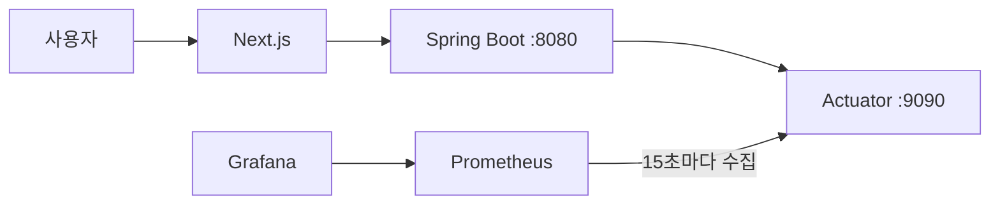

# Re:Fail 관측성 운영 가이드

## 1. 목표

API 요청량, 오류율, 지연 시간, JVM 메모리, DB 커넥션 풀과 요청 제한 초과를 한 화면에서 확인한다. 장애가 발생한 뒤 로그를 뒤지는 방식이 아니라 이상 징후를 먼저 발견할 수 있는 최소 운영 구성을 제공한다.

## 2. 구성



- 애플리케이션 API는 컨테이너의 `8080` 포트를 사용한다.
- Actuator는 컨테이너 내부의 별도 `9090` 관리 포트를 사용한다.
- 관리 포트는 호스트에 공개하지 않고 Docker 네트워크의 Prometheus만 접근한다.
- 일반 로컬 실행에서는 `OBSERVABILITY_INTERNAL_METRICS=false`가 기본이며 `/actuator/prometheus`에 관리자 JWT가 필요하다.

## 3. 실행

```powershell
Copy-Item .env.example .env
docker compose --profile observability --env-file .env up -d --build
```

접속 주소:

- 서비스: `http://localhost:3000`
- Prometheus: `http://localhost:19090`
- Grafana: `http://localhost:13000`

Grafana 로그인 정보는 `.env`의 `GRAFANA_ADMIN_USER`, `GRAFANA_ADMIN_PASSWORD`를 사용한다.

## 4. 대시보드

`ReFail / Re:Fail 운영 개요` 대시보드는 다음 지표를 제공한다.

| 패널 | 확인 목적 |
| --- | --- |
| 초당 API 요청 | 트래픽 변화 |
| 서버 오류율 | 전체 요청 중 5xx 비율 |
| API p95 응답 시간 | 느린 요청 증가 |
| JVM Heap | 메모리 압박 |
| DB 커넥션 풀 | DB 연결 고갈 |
| 요청 제한 초과 | 로그인 공격·과도한 신고 등 이상 요청 |

## 5. 경보 규칙

| 경보 | 조건 | 지속 시간 |
| --- | --- | --- |
| `ReFailHighServerErrorRate` | 5xx 비율 5% 초과 | 5분 |
| `ReFailHighP95Latency` | p95 1초 초과 | 5분 |
| `ReFailRateLimitSpike` | 5분간 요청 제한 20회 초과 | 1분 |

현재 구성은 Alertmanager 전송 없이 Prometheus 규칙 상태까지 제공한다. 실제 운영에서는 이메일이나 메신저 알림 채널과 Alertmanager를 추가한다.

## 6. 보안 원칙

- 운영 환경에서 관리 포트를 인터넷에 공개하지 않는다.
- `OBSERVABILITY_INTERNAL_METRICS=true`는 관리 포트가 내부 네트워크에만 있을 때 사용한다.
- Grafana 기본 비밀번호를 사용하지 않고 `.env`에서 교체한다.
- 메트릭 라벨에 이메일, 사용자 ID, IP, 검색어를 포함하지 않는다.
