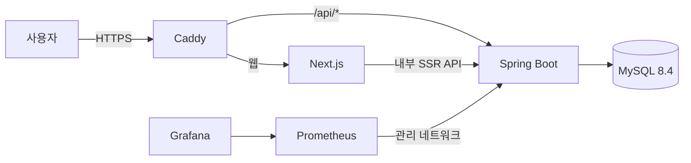

# Re:Fail 백엔드 개발 포트폴리오

## 1. 프로젝트 소개

> **Re:Fail - 실패를 공유하고, 다음을 준비하다**

성공 중심 SNS의 비교 피로를 문제로 정의하고, 사용자가 크고 작은 실패와 그 이후의 변화를 안전하게 기록하는 텍스트 중심 서비스입니다.

### 핵심 성과

| 영역 | 결과 |
| --- | --- |
| 검색 성능 | 로컬 MySQL 8.4의 게시글 5만 건 본문 검색 평균 `72.47ms → 6.57ms` |
| 조회 효율 | 게시글 목록 SQL 최대 3회 고정, 관리자 지표 API SQL `7회 → 2회` |
| 데이터 정합성 | 공감·신고 각각 8개 동시 요청에서 카운터와 실제 행 개수 일치 |
| 인증 보안 | 15분 Access Token, 해시 저장·회전형 Refresh Token, 재사용 탐지 |
| 운영 검증 | Caddy HTTPS 단일 진입점과 인증·포트 경계 10단계 CI 스모크 |

측정 수치는 2026-07-24 로컬 Docker Desktop과 MySQL 8.4에서 얻은 결과이며 실제 운영 트래픽 성과가 아닙니다.

---

## 2. 문제 정의와 서비스 목표

SNS에서는 성공과 행복이 주로 공유되지만 실제 일상은 항상 성공적이지 않습니다. 타인의 결과와 자신의 현재를 비교하는 환경에서는 실패가 학습 과정이 아니라 개인의 가치 문제처럼 받아들여질 수 있습니다.

Re:Fail은 불행을 전시하는 공간이 아니라 실패를 회고하고 다음 선택을 기록하는 공간을 목표로 합니다. 사용자는 익명 또는 닉네임으로 실패를 작성하고, 공격적인 댓글 대신 제한된 공감 반응을 받습니다. 이후 `다시 시도 중`, `잠시 멈춤`, `조금씩 나아지는 중`, `극복함` 상태의 후속 기록을 연결해 실패가 변화 과정으로 남도록 설계했습니다.

완전 익명만 사용하면 작성 장벽은 낮지만 본인의 기록 관리와 성장 흐름 연결이 어렵습니다. 반대로 실명 중심 구조는 실패를 쓰는 부담을 높입니다. 외부 공개 방식은 글마다 선택하게 하고 내부 소유권은 인증 사용자 ID로 관리해 감정적 안전과 기록의 연속성을 함께 확보했습니다.

---

## 3. 담당 범위와 기술 스택

개인 프로젝트로 서비스 기획, API와 데이터베이스 설계, 백엔드·프론트엔드 구현, 테스트, 컨테이너 실행 환경과 CI 구성을 담당했습니다. 실제 팀 협업이나 운영 사용자 경험으로 확대해 표현하지 않습니다.

| 영역 | 기술과 역할 |
| --- | --- |
| 백엔드 | Java 21, Spring Boot 3.5.3, Spring Data JPA, Spring Security |
| 데이터베이스 | MySQL 8.4, Flyway, H2 |
| 인증 | JWT Access Token, 회전형 Refresh Token |
| 프론트엔드 | Next.js 16, React 19, TypeScript, React Markdown |
| 테스트 | JUnit 5, Spring Boot Integration Test, Testcontainers, Playwright |
| 운영 | Docker Compose, Caddy 2.11, Prometheus, Grafana, GitHub Actions |

주요 구현 범위는 회원가입·로그인, 게시글과 후속 기록 CRUD, 검색·필터·페이지네이션, 공감, 신고, 관리자 숨김·복구와 사용자 제한, 운영 지표입니다. 이미지, DM, 팔로우와 댓글은 핵심 흐름에 필수적이지 않고 저장 비용·괴롭힘 대응·인기 경쟁 같은 운영 문제를 먼저 만들 수 있어 MVP에서 제외했습니다.

---

## 4. 시스템 아키텍처와 기술 선택

현재 제품은 텍스트 중심 MVP이며 인증, 게시글, 공감, 신고가 하나의 트랜잭션 경계 안에 있습니다. 마이크로서비스를 도입하면 독립 확장성보다 배포·네트워크·분산 트랜잭션 복잡도가 먼저 증가한다고 판단했습니다. 따라서 배포 단위는 Spring Boot 단일 서버로 유지하고 `auth`, `post`, `reaction`, `report`, `admin` 도메인 패키지로 책임을 분리했습니다.

운영형 구성에서는 Caddy만 HTTP·HTTPS 포트를 공개합니다. MySQL, Spring Boot, Next.js와 관측성 포트는 Docker 내부 네트워크에 두고 웹과 API를 동일 출처로 제공합니다. 개발 편의 구성과 운영 보안 경계를 별도 Compose override로 분리했습니다.

---

## 5. 대표 문제 해결 사례

### 5.1 JPA N+1 제거와 SQL 회귀 기준

**결과: 게시글 수와 무관하게 목록 조회 SQL을 최대 3회로 고정했습니다.** DTO 변환 과정에서 작성자와 카테고리를 지연 로딩해 게시글마다 추가 SQL이 실행되는 문제를 Hibernate Statistics로 확인했습니다. 페이지네이션을 유지하기 위해 단건 연관은 `EntityGraph`로 조회하고, 후속 기록 여부는 현재 페이지 ID를 모아 한 번에 조회했습니다. 게시글 10건에서도 목록·전체 개수·후속 기록 여부 SQL이 3회를 넘지 않는 통합 테스트를 추가했습니다. 쿼리 수 감소가 운영 응답 시간을 보장하지는 않으므로 실제 배포 후 DB 부하와 네트워크를 포함한 측정은 남아 있습니다.

### 5.2 MySQL FULLTEXT 검색 최적화

**결과: 게시글 5만 건 본문 검색 평균을 `72.47ms`에서 `6.57ms`로 약 90.9% 줄였습니다.** `%LIKE%` 방식은 노출 가능한 게시글을 전체 스캔해 데이터 증가 시 일반 B-Tree 인덱스를 활용하기 어려웠습니다. 별도 검색 서버는 현재 규모에 비해 운영 복잡도가 크다고 판단해 MySQL ngram FULLTEXT로 ID 페이지를 먼저 조회하고 연관 데이터는 `EntityGraph`로 가져왔습니다. MySQL 8.4에서 3회 워밍업 후 10회 측정했으며 p95도 `105.49ms → 7.84ms`로 줄었습니다. 한 글자 검색은 LIKE로 폴백하며, 형태소·동의어 검색이 필요해질 때 별도 검색 엔진을 검토합니다.

### 5.3 lost update와 InnoDB 교착 상태 해결

**결과: 공감·신고 각각 8개 동시 요청에서 집계 값과 실제 행 개수가 모두 8로 일치했습니다.** 엔티티 카운터를 읽고 증가시킨 뒤 저장하면 마지막 쓰기만 남는 lost update 가능성이 있었습니다. 이를 `count = count ± 1` 형태의 DB 원자적 UPDATE로 변경하고 벌크 갱신 후 영속성 컨텍스트를 초기화했습니다. Testcontainers 전환 중에는 부모 카운터와 자식 행의 잠금 순서가 달라 InnoDB 교착이 발생해 모든 경로의 잠금 순서를 통일했습니다. 이 검증은 정합성 회귀 기준이며 장시간 고부하 처리량을 증명하지는 않습니다.

### 5.4 JWT 수명주기와 즉시 권한 회수

**결과: 15분 Access Token과 해시 저장·회전형 Refresh Token으로 인증 수명주기를 구성했습니다.** 장기 Access Token만으로는 탈취 영향과 로그아웃·관리자 제한 이후의 권한 회수 범위가 불명확했습니다. Refresh Token은 원문 대신 SHA-256 해시를 저장하고 갱신마다 회전하며, 폐기된 토큰의 재사용이 탐지되면 같은 계열을 모두 폐기합니다. 관리자 API는 JWT role claim만 믿지 않고 DB의 현재 역할과 `ACTIVE` 상태를 확인해 기존 JWT가 있어도 제한 즉시 `403`으로 차단합니다. DB 조회 비용은 늘지만 사용자 콘텐츠 서비스의 강제 로그아웃과 권한 회수를 우선한 선택입니다.

### 5.5 HTTPS 단일 진입점과 운영 스모크

**결과: Caddy 외 서비스의 호스트 포트를 제거하고 HTTPS 인증 흐름 10단계를 CI에서 검증했습니다.** 개발 Compose는 DB·API·웹 포트를 각각 공개했고 Secure Cookie와 동일 출처 API가 실제 프록시에서 동작한다는 근거가 없었습니다. Kubernetes 대신 Caddy 하나를 공개 게이트웨이로 두고 운영 override에서 내부 서비스 포트를 제거했습니다. 별도 Docker 프로젝트로 HTTP 리다이렉트, 보안 헤더, Swagger 비노출, 로그인, Refresh Token 회전, 게시글 작성과 로그아웃 폐기를 검증합니다. 로컬 스모크는 내부 CA를 사용하므로 공개 인증서와 실제 외부 서버 배포는 아직 증명하지 않았습니다.

---

## 6. 테스트·CI·운영 준비

빠른 도메인·API 회귀는 H2 기반 통합 테스트로 유지하고, InnoDB 잠금·MySQL 제약·Flyway처럼 실제 DB 의존성이 큰 흐름은 Testcontainers MySQL 8.4로 분리했습니다. 테스트 실행 시간은 늘지만 수동 검증을 독립된 스키마와 동일한 DB 버전에서 반복할 수 있게 했습니다.

| 검증 계층 | 검증 범위 |
| --- | --- |
| 백엔드 테스트 | 40개: 권한, 상태 정책, 쿼리 수, 동시성, Flyway, Refresh Token |
| 프론트엔드 | ESLint와 production build |
| Playwright P0 | 공개 탐색, 작성자 CRUD·후속 기록, 관리자 신고·숨김·복구 3개 |
| 운영 스모크 | HTTPS, 보안 헤더, Secure Cookie, 인증 회전·폐기, 포트 비노출 10단계 |
| 관측성 | `X-Request-ID`, 처리 시간 로그, Micrometer, Prometheus, Grafana |

GitHub Actions는 백엔드, 프론트엔드, Playwright와 운영 스모크를 독립 작업으로 실행합니다. 브라우저 검증 실패 시 trace·영상·스크린샷과 Compose 로그를 artifact로 남기도록 구성했습니다.

---

## 7. 성과 요약

| 문제 | 선택 | 검증 결과 |
| --- | --- | --- |
| 목록 N+1 | `EntityGraph`와 페이지 ID 일괄 조회 | 게시글 10건 SQL 최대 3회 |
| `%LIKE%` 전체 스캔 | MySQL ngram FULLTEXT | 5만 건 본문 평균 `72.47ms → 6.57ms` |
| 집계 lost update | DB 원자적 UPDATE | 공감·신고 각 8개 동시 요청 정합성 |
| InnoDB 교착 | 부모·자식 행 잠금 순서 통일 | Testcontainers 반복 테스트 통과 |
| 관리자 지표 다중 조회 | 여섯 집계를 단일 SQL로 통합 | API SQL `7회 → 2회`, 평균 `6.75ms → 3.18ms` |
| 토큰 탈취·재사용 | 해시 저장, 회전, 계열 폐기 | 재사용·동시 갱신·로그아웃 테스트 |
| 개발 포트 직접 노출 | Caddy HTTPS 단일 진입점 | Caddy 외 호스트 포트 없음 |

---

## 8. 한계와 다음 단계

- 공개 도메인과 외부 서버를 이용한 실제 배포는 완료하지 않았습니다.
- 로컬 스모크의 Caddy 내부 CA는 공개 인증서가 아닙니다.
- 장시간 부하, 디스크 고갈, 다중 인스턴스와 장애 조치는 검증 범위 밖입니다.
- 운영 데이터 기반 검색 품질과 인덱스 쓰기 비용은 실제 사용 이후 다시 측정해야 합니다.
- 외부 저장소를 이용한 자동 백업과 복구 시간 측정이 필요합니다.

다음 단계는 비용 상한이 정해진 단일 서버에 실제 도메인을 연결하고, 자동 백업을 복원해 복구 시간과 데이터 손실 범위를 기록하는 것입니다.

---

## 9. 링크

- GitHub: [duvwlq/refail](https://github.com/duvwlq/refail)
- 상세 문제 해결: [포트폴리오 문제 해결 구문](PORTFOLIO_PROBLEM_SOLVING.md)
- 성능 측정: [백엔드 성능 설계](PERFORMANCE.md)
- 인증 정책: [인증 수명주기와 보안 정책](AUTH_SECURITY.md)
- 아키텍처: [시스템 아키텍처](ARCHITECTURE.md)
- 운영 구성: [운영 배포 가이드](DEPLOYMENT.md)
- 시연 순서: [대표 시연 시나리오](DEMO_SCENARIO.md)
- 영상 촬영안: [3~5분 시연 영상 대본](DEMO_VIDEO_SCRIPT.md)
