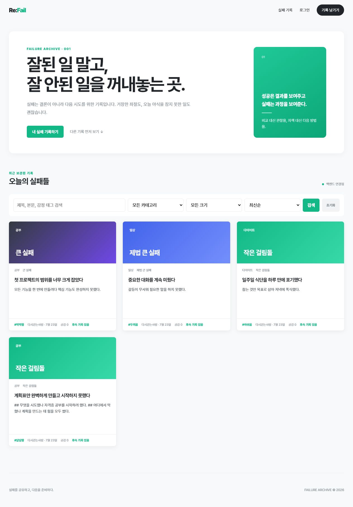
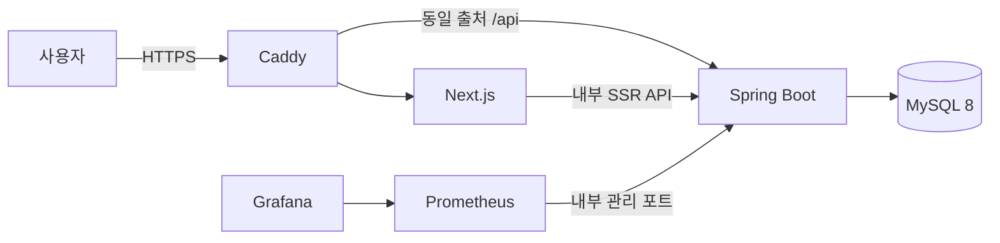
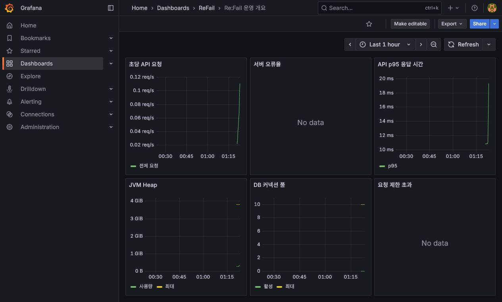

# Re:Fail

> 실패를 공유하고, 다음을 준비하다.

Re:Fail은 성공과 행복이 주로 노출되는 환경에서 크고 작은 실패를 안전하게 기록하고, 후속 기록을 통해 다시 시도하거나 극복하는 과정을 남기는 서비스입니다. 불행을 전시하는 것이 아니라 실패를 돌아보고 같은 실수를 반복하지 않도록 돕는 것을 목표로 합니다.



## 핵심 성과

| 문제 | 개선 결과 |
| --- | --- |
| MySQL 5만 건 본문 검색 | `%LIKE%` 평균 `72.47ms`에서 ngram FULLTEXT `6.57ms`로 단축 |
| 관리자 운영 지표 | SQL `7개 → 2개`, 집계 평균 `6.75ms → 3.18ms` |
| 공감·신고 동시 요청 | MySQL 8.4에서 각 8개 동시 요청의 행 수와 집계 값 일치 |
| 인증 수명주기 | 15분 Access Token, 회전형 Refresh Token, 재사용 탐지와 계열 폐기 |
| 자동 검증 | 백엔드 40개, Playwright P0 3개, HTTPS 운영 배포 스모크 10단계 |
| 운영 경계 | Caddy HTTPS 단일 진입점, DB·백엔드·프론트엔드 호스트 포트 비노출 |

## 핵심 기능

- 익명 또는 닉네임으로 실패 기록 작성
- 마크다운 에디터, 미리보기, 브라우저 자동 임시 저장
- `다시 시도 중`, `잠시 멈춤`, `조금씩 나아지는 중`, `극복함` 후속 기록
- 최신순·공감순 정렬, 카테고리·실패 크기 필터, 제목·본문 검색
- 제한된 공감 반응과 본인 게시글 공감 방지
- 신고, 관리자 게시글 숨김·복구, 사용자 제한, 운영 감사 이력
- 후속 기록률과 상태 비율을 확인하는 운영 지표

댓글, DM, 팔로우는 실패 경험에 대한 공격적인 상호작용과 운영 비용을 줄이고 핵심 흐름에 집중하기 위해 MVP에서 제외했습니다.

## 기술 스택

| 영역 | 기술 |
| --- | --- |
| 프론트엔드 | Next.js 16, React 19, TypeScript, React Markdown |
| 백엔드 | Java 21, Spring Boot 3.5, Spring Data JPA, Spring Security |
| 인증 | JWT Access Token, 회전형 Refresh Token |
| 데이터베이스 | MySQL 8, Flyway |
| API 문서 | Swagger UI, OpenAPI |
| 테스트 | JUnit 5, Spring Boot Integration Test, H2, Testcontainers MySQL 8.4 |
| 실행 환경 | Docker Compose, Caddy 2.11, GitHub Actions |

## 구조



백엔드는 단일 서버 안에서 `auth`, `post`, `reaction`, `report`, `admin` 도메인 패키지로 경계를 나눴습니다. 현재 규모에서 마이크로서비스의 운영 복잡도를 추가하지 않고 핵심 사용자 흐름과 데이터 정합성에 집중한 선택입니다.

상세 흐름은 [시스템 아키텍처](ARCHITECTURE.md)에서 확인할 수 있습니다.

## 주요 기술 개선

### 조회 성능

- `EntityGraph`로 게시글·신고 목록의 N+1 문제 제거
- 페이지 내 후속 기록 존재 여부 일괄 조회
- 사용자 기록·실패 크기·후속 상태에 맞춘 MySQL 복합 인덱스
- 게시글 10건 목록 조회 SQL 최대 3회 회귀 테스트
- 로컬 워밍업 후 게시글 목록 평균 응답 약 26ms
- MySQL ngram FULLTEXT 검색 적용: 5만 건 본문 검색 평균 `72.47ms → 6.57ms`
- 관리자 운영 지표 API SQL `7개 → 2개`, 집계 평균 `6.75ms → 3.18ms`

### 동시성과 정합성

- 공감·신고 카운터를 DB 원자적 UPDATE로 갱신
- 실제 MySQL 8.4에서 공감·신고 각각 8개 동시 요청의 카운터와 실제 행 개수 일치 검증
- 자식 행 INSERT와 부모 집계 UPDATE의 잠금 순서를 통일해 InnoDB 교착 상태 제거
- 유니크 제약 충돌을 도메인별 `409 Conflict`로 변환

### 보안과 운영

- JWT 기반 서버 소유권 검증
- 제한된 관리자의 기존 토큰 접근 차단
- 숨김·삭제 게시글의 하위 기록 노출 차단
- 운영 JWT 시크릿 환경 변수 필수화와 issuer 검증
- 신고 처리, 숨김·복구, 처리자·사유 감사 이력 저장
- 요청별 `X-Request-ID`와 API 처리 시간 로그, Micrometer·Prometheus 메트릭 제공
- 운영 프로필의 Swagger 기본 비활성화와 Actuator 관리 API 관리자 권한 보호
- 15분 Access Token과 해시 저장·회전형 Refresh Token, 로그아웃·사용자 제한 세션 폐기
- 로그인·회원가입·토큰 갱신·신고 API 요청 제한과 `429`·`Retry-After` 응답
- Prometheus·Grafana 기반 API/JVM/DB 풀 모니터링과 경보 규칙
- Caddy HTTPS 단일 진입점과 동일 출처 API 구성
- 운영 Compose에서 MySQL·Spring Boot·Next.js·관리 포트 직접 노출 제거
- Secure Refresh Cookie 회전과 로그아웃 폐기를 포함한 운영 배포 스모크 자동화

상세한 문제 해결 과정은 [포트폴리오 개선 기록](PORTFOLIO_IMPROVEMENTS.md)과 [백엔드 리뷰 결과](BACKEND_REVIEW_RESULT.md)에서 확인할 수 있습니다.

## Docker Compose 실행

Docker Desktop을 실행한 뒤 환경 변수 예시를 복사하고 비밀번호와 JWT 시크릿을 반드시 변경합니다.

```powershell
Copy-Item .env.example .env
docker compose up --build -d
docker compose ps
```

- Web: `http://localhost:3000`
- API: `http://localhost:18080`
- Health: `http://localhost:18080/api/v1/health`
- 운영 프로필에서는 Swagger가 기본 비활성화됩니다. 로컬 확인이 필요할 때만 `.env`의 `SWAGGER_ENABLED=true`를 사용합니다.

관측성 스택까지 실행하려면 다음 프로필을 사용합니다.

```powershell
docker compose --profile observability --env-file .env up -d --build
```

- Prometheus: `http://localhost:19090`
- Grafana: `http://localhost:13000`

MySQL 볼륨이 생성된 뒤 DB 비밀번호를 변경하면 기존 사용자 정보와 달라질 수 있습니다. 기존 데이터 보존이 필요하면 DB 사용자 비밀번호도 함께 변경해야 합니다.

## 운영형 HTTPS 실행

실제 서버에서는 `.env.production.example`을 복사해 도메인과 모든 `change-me` 값을 교체한 뒤 운영 Compose를 함께 사용합니다.

```powershell
Copy-Item .env.production.example .env.production
docker compose -f compose.yaml -f compose.production.yaml --env-file .env.production up -d --build --wait --wait-timeout 240
```

운영 구성은 Caddy의 HTTP·HTTPS만 공개하고 MySQL, 백엔드, 프론트엔드와 관리 포트를 Docker 내부에 둡니다. DNS, 방화벽, 인증서, 업데이트, 백업·복구 절차는 [운영 배포 가이드](DEPLOYMENT.md)를 따릅니다.

## 개별 로컬 실행

### 1. MySQL과 백엔드 실행

```powershell
Copy-Item .env.example .env
docker compose --env-file .env up -d mysql
$env:MYSQL_PASSWORD="change-this-database-password"
$env:JWT_SECRET="change-this-jwt-secret-to-at-least-48-characters-long"
.\gradlew.bat bootRun --args="--spring.profiles.active=docker"
```

- API: `http://localhost:18080`
- Swagger UI: `SWAGGER_ENABLED=true`일 때 `http://localhost:18080/swagger-ui.html`
- Health: `http://localhost:18080/actuator/health`

### 2. 프론트엔드 실행

```powershell
cd frontend
copy .env.example .env.local
npm install
npm run dev
```

- Web: `http://localhost:3000`

### 3. 시연 데이터 생성

```powershell
powershell.exe -NoProfile -ExecutionPolicy Bypass -File .\scripts\seed-demo-data.ps1
```

| 구분 | 이메일 | 비밀번호 |
| --- | --- | --- |
| 일반 사용자 | `demo@refail.local` | `password123` |
| 관리자 | `admin@refail.local` | `password123` |

시연 계정은 로컬 환경 전용입니다.

## 테스트

```powershell
.\gradlew.bat test
cd frontend
npm run lint
npm run build
```

P0 브라우저 시나리오는 루트에서 E2E 환경과 관리자를 준비한 뒤 실행합니다.

```powershell
docker compose -f compose.yaml -f compose.e2e.yaml --env-file .env.example up -d --build --wait --wait-timeout 180
powershell.exe -NoProfile -ExecutionPolicy Bypass -File .\scripts\seed-e2e-admin.ps1
cd frontend
npm run test:e2e
```

GitHub Actions에서도 백엔드 테스트, 프론트엔드 lint·build, Playwright P0 시나리오 3개를 실행합니다. 브라우저 테스트가 실패하면 trace, 영상, 스크린샷과 Compose 로그를 artifact로 보존합니다.

운영 HTTPS 구성은 별도 스모크로 검증합니다.

```powershell
powershell.exe -NoProfile -ExecutionPolicy Bypass -File .\scripts\test-production-deployment.ps1
```

이 검증은 HTTP 리다이렉트, 보안 헤더, Swagger 비노출, Secure Refresh Cookie 회전, 게시글 작성, 로그아웃 후 토큰 폐기와 Caddy 외 포트 비노출을 확인합니다.

백엔드 전체 테스트에는 Docker 기반 MySQL 8.4 Testcontainers 테스트가 포함됩니다. Flyway 마이그레이션, 동시 공감·신고·토큰 갱신 정합성, 사용자 운영 이력, 삭제 사용자와 비활성 카테고리 정책을 실제 MySQL에서 검증합니다. 최종 검증 기준 40개 테스트가 모두 통과했습니다.

검색 성능은 별도 작업으로 재현할 수 있습니다.

```powershell
.\scripts\benchmark-search.ps1 -PostCount 10000
.\scripts\benchmark-search.ps1 -PostCount 50000
```

## 관측성



- 모든 HTTP 응답은 `X-Request-ID`를 반환하고 같은 ID를 서버 로그에 기록합니다.
- 공개 상태 확인은 `/api/v1/health`를 사용하고, Actuator는 관리 포트에서만 제공합니다.
- `/actuator/metrics/http.server.requests`와 `/actuator/prometheus`는 관리자 JWT가 필요합니다.
- `http.server.requests`의 `status`, `outcome`, `uri`, 처리 시간으로 요청 수, 오류율, 지연 시간을 확인할 수 있습니다.

## 문서

- [API 명세](API_SPEC.md)
- [인증 수명주기와 보안 정책](AUTH_SECURITY.md)
- [API 요청 제한 정책](RATE_LIMIT_POLICY.md)
- [관측성 운영 가이드](OBSERVABILITY.md)
- [시스템 아키텍처와 핵심 흐름](ARCHITECTURE.md)
- [운영 배포·백업·복구 가이드](DEPLOYMENT.md)
- [대표 시연 시나리오](DEMO_SCENARIO.md)
- [3~5분 시연 영상 대본](DEMO_VIDEO_SCRIPT.md)
- [ERD](ERD.md)
- [백엔드 구조](BACKEND_STRUCTURE.md)
- [MySQL·Flyway 가이드](DATABASE.md)
- [성능 설계](PERFORMANCE.md)
- [다음 작업 계획](NEXT_WORK_PLAN.md)
- [리팩터링 기록](REFACTORING_LOG.md)
- [포트폴리오 개선 기록](PORTFOLIO_IMPROVEMENTS.md)
- [전체 문서 안내](DOCUMENT_INDEX.md)
