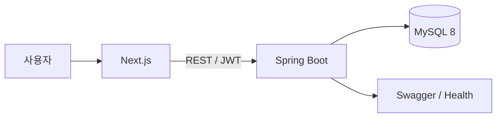

# Re:Fail

> 실패를 공유하고, 다음을 준비하다.

Re:Fail은 성공과 행복이 주로 노출되는 환경에서 크고 작은 실패를 안전하게 기록하고, 후속 기록을 통해 다시 시도하거나 극복하는 과정을 남기는 서비스입니다. 불행을 전시하는 것이 아니라 실패를 돌아보고 같은 실수를 반복하지 않도록 돕는 것을 목표로 합니다.

## 핵심 기능

- 익명 또는 닉네임으로 실패 기록 작성
- 마크다운 에디터, 미리보기, 브라우저 자동 임시 저장
- `다시 시도 중`, `잠시 멈춤`, `조금씩 나아지는 중`, `극복함` 후속 기록
- 최신순·공감순 정렬, 카테고리·실패 크기 필터, 제목·본문 검색
- 제한된 공감 반응과 본인 게시글 공감 방지
- 신고, 관리자 게시글 숨김·복구, 사용자 제한, 운영 감사 이력
- 후속 기록률과 상태 비율을 확인하는 운영 지표

댓글, DM, 팔로우는 실패 경험에 대한 공격적인 상호작용과 운영 비용을 줄이고 핵심 흐름에 집중하기 위해 MVP에서 제외했습니다.

## 기술 스택

| 영역 | 기술 |
| --- | --- |
| 프론트엔드 | Next.js 16, React 19, TypeScript, React Markdown |
| 백엔드 | Java 21, Spring Boot 3.5, Spring Data JPA, Spring Security |
| 인증 | JWT Bearer 인증 |
| 데이터베이스 | MySQL 8, Flyway |
| API 문서 | Swagger UI, OpenAPI |
| 테스트 | JUnit 5, Spring Boot Integration Test, H2 MySQL 호환 모드 |
| 로컬 환경 | Docker Compose |

## 구조



백엔드는 단일 서버 안에서 `auth`, `post`, `reaction`, `report`, `admin` 도메인 패키지로 경계를 나눴습니다. 현재 규모에서 마이크로서비스의 운영 복잡도를 추가하지 않고 핵심 사용자 흐름과 데이터 정합성에 집중한 선택입니다.

## 주요 기술 개선

### 조회 성능

- `EntityGraph`로 게시글·신고 목록의 N+1 문제 제거
- 페이지 내 후속 기록 존재 여부 일괄 조회
- 사용자 기록·실패 크기·후속 상태에 맞춘 MySQL 복합 인덱스
- 게시글 10건 목록 조회 SQL 최대 3회 회귀 테스트
- 로컬 워밍업 후 게시글 목록 평균 응답 약 26ms

### 동시성과 정합성

- 공감·신고 카운터를 DB 원자적 UPDATE로 갱신
- 실제 MySQL 동시 요청에서 카운터와 실제 행 개수 일치 검증
- 유니크 제약 충돌을 도메인별 `409 Conflict`로 변환

### 보안과 운영

- JWT 기반 서버 소유권 검증
- 제한된 관리자의 기존 토큰 접근 차단
- 숨김·삭제 게시글의 하위 기록 노출 차단
- 운영 JWT 시크릿 환경 변수 필수화와 issuer 검증
- 신고 처리, 숨김·복구, 처리자·사유 감사 이력 저장

상세한 문제 해결 과정은 [포트폴리오 개선 기록](PORTFOLIO_IMPROVEMENTS.md)과 [백엔드 리뷰 결과](BACKEND_REVIEW_RESULT.md)에서 확인할 수 있습니다.

## 로컬 실행

### 1. MySQL 실행

```powershell
docker compose up -d mysql
```

### 2. 백엔드 실행

```powershell
.\gradlew.bat bootRun --args="--spring.profiles.active=docker"
```

- API: `http://localhost:18080`
- Swagger UI: `http://localhost:18080/swagger-ui.html`
- Health: `http://localhost:18080/api/v1/health`

### 3. 프론트엔드 실행

```powershell
cd frontend
copy .env.example .env.local
npm install
npm run dev
```

- Web: `http://localhost:3000`

### 4. 시연 데이터 생성

```powershell
powershell.exe -NoProfile -ExecutionPolicy Bypass -File .\scripts\seed-demo-data.ps1
```

| 구분 | 이메일 | 비밀번호 |
| --- | --- | --- |
| 일반 사용자 | `demo@refail.local` | `password123` |
| 관리자 | `admin@refail.local` | `password123` |

시연 계정은 로컬 환경 전용입니다.

## 테스트

```powershell
.\gradlew.bat test
cd frontend
npm run lint
npm run build
```

GitHub Actions에서도 백엔드 테스트와 프론트엔드 lint·build를 실행합니다.

## 문서

- [API 명세](API_SPEC.md)
- [ERD](ERD.md)
- [백엔드 구조](BACKEND_STRUCTURE.md)
- [MySQL·Flyway 가이드](DATABASE.md)
- [성능 설계](PERFORMANCE.md)
- [포트폴리오 개선 기록](PORTFOLIO_IMPROVEMENTS.md)
- [전체 문서 안내](DOCUMENT_INDEX.md)
